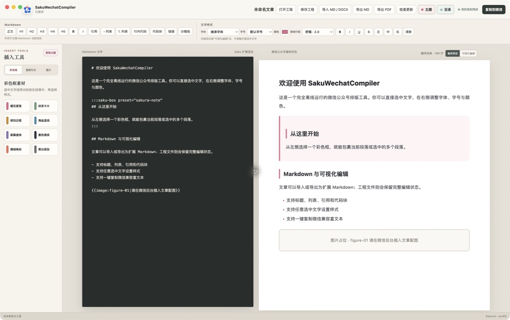
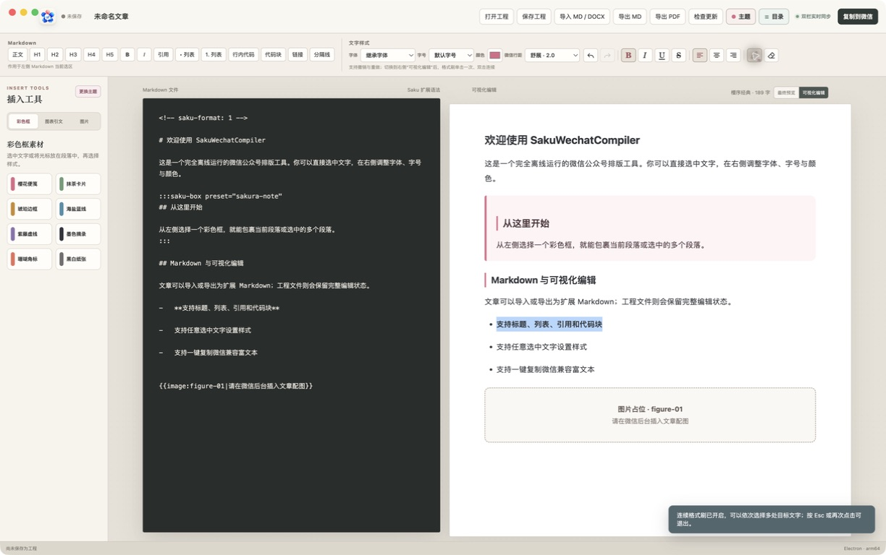
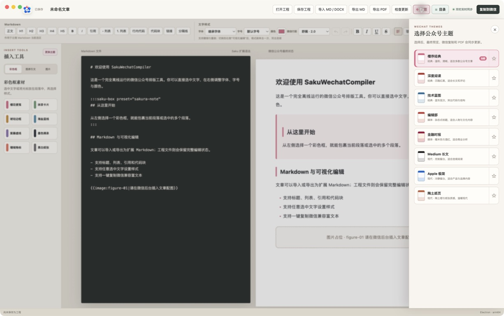
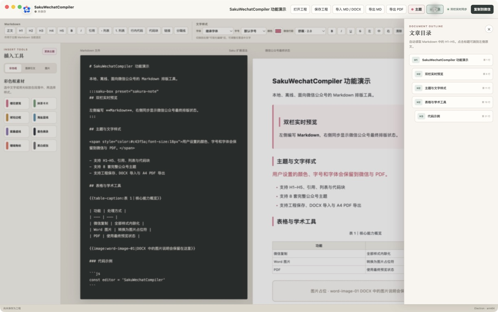

# SakuWechatCompiler

SakuWechatCompiler 是一款面向微信公众号的本地排版编辑器。主编辑区左侧编写 Markdown，右侧实时显示微信公众号排版效果。应用仅面向 Apple Silicon Mac，安装后无需联网即可编辑、保存和生成微信富文本。

当前版本：`0.2.6`

由 [UrbanComp 团队](https://urbancomp.net)制作。

## 界面预览

### Markdown 与微信公众号最终状态

左侧编辑 Markdown，右侧显示复制到微信公众号和导出 PDF 时使用的最终排版；顶部集中提供 Markdown 快捷按钮、文字样式、微信行距、主题、目录、检查更新和文件操作。



### 可视化格式工具

切换到“可视化编辑”后，可用常见办公软件图标进行撤销、重做、粗体、斜体、下划线、删除线、段落对齐和清除格式。格式刷单击使用一次，双击进入连续模式。



### 公众号主题

内置 8 套完整主题。切换主题时，标题、正文、列表、引用、表格、代码、图题和图片占位符会同步更新；用户手动设置的颜色始终优先于主题强调色。



### H1–H5 文章目录

目录会读取 Markdown 中的一至五级标题，显示层级与行号，并可点击跳转到左侧原文。



## 下载与安装

1. 在 [GitHub Releases](https://github.com/whuyao/SakuWechatCompiler/releases) 下载 `SakuWechatCompiler-0.2.6-arm64.dmg`。
2. 打开 DMG，把 SakuWechatCompiler 拖入“应用程序”。
3. 当前安装包尚未使用 Developer ID 签名。首次启动如被 macOS 拦截，请在 Finder 中右键应用并选择“打开”。

升级已有安装时，请先退出正在运行的旧版本，再从新版 DMG 将 App 拖入“应用程序”并选择替换；仅打开电脑中原有的 App 不会自动切换到新版。

只支持 Apple Silicon（M1、M2、M3、M4 及后续 M 系列），不提供 Intel 版本。

## 典型工作流程

```text
导入 MD / DOCX 或新建文章
        ↓
左侧编辑 Markdown，右侧检查最终状态
        ↓
选择主题、文字样式、彩色框和图表工具
        ↓
保存 .sakuwechat 工程
        ↓
复制到微信 / 导出 Markdown / 导出 A4 PDF
```

DOCX 中的图片不会直接嵌入 Markdown，也不会尝试上传到微信。应用会按顺序生成 `word-image-01`、`word-image-02` 等占位符，保留图片的替代文字并提示图片数量；排版完成后，在微信公众号后台对应位置重新插入图片即可。

## 0.2.6 重点更新

- 修复 Word/DOCX 将连续中文粗体拆成多个 run 后可能生成连续四个星号、导致 Markdown 粗体边界解析错误的问题。
- 自动合并相邻且格式相同的粗体或斜体 run，并兼容夹在其间的 Word 空书签。
- 严格保留原文已有空格：`**中文粗体** 后文` 不再丢失空格；原文没有空格时也不会凭空在中文之间增加空格。

## 0.2.5 重点更新

- 新增 Adobe Reader 风格的双排页面缩放，左侧 Markdown 纸张与右侧公众号纸张会在 50%–200% 之间同步整体缩放；点击百分比可恢复 100%。
- 文章目录新增图钉固定功能。固定后目录常驻右侧、点击标题不收起，编辑区会自动预留空间，固定状态保存在本机。
- 增加常用中文字体：苹方、宋体、黑体、楷体、仿宋、冬青黑体和圆体。
- 增加常用英文字体：Helvetica Neue、Arial、Avenir Next、Georgia、Times New Roman、Baskerville、Palatino 和 Menlo。
- 所有新增字体均使用 macOS 本机字体和同类回退字体，不依赖互联网；字体样式可安全往返 Markdown，并保留到最终预览、微信复制和 PDF。
- 更新主界面截图，展示双排页面缩放和固定目录的实际效果。

## 0.2.4 重点更新

- 修复格式刷拖选目标文字后无法应用的问题；单击使用一次，双击进入带 `∞` 标记的连续模式，按 Esc 或再次点击退出。
- 新增常用的撤销、重做图标，支持 `⌘Z` 与 `⇧⌘Z`，并根据编辑历史自动启用或禁用。
- 新增 Word 风格的小刷子、粗体、斜体、下划线、删除线、段落对齐和清除格式图标。
- 从 MD 或 DOCX 导入后，首次保存工程会沿用原文件名，并默认定位到原文档目录。
- 顶栏不再重复显示程序名，文章标题改为靠左的紧凑布局，避免与右侧操作按钮重叠。
- 修复点击窗口关闭按钮并选择“不保存并退出”后只关闭窗口、应用进程仍留在后台的问题。
- 修复连续点击粗体、斜体等字形按钮时选区可能丢失的问题，同一段文字可稳定叠加为粗斜体。
- Word/DOCX 导入会规范化粗体两侧的空白，并兼容 `<strong>/<b>` 与 `<em>/<i>`；`**粗体**后文` 无需额外空格也能正确解析。

## 0.2.3 重点更新

- 顶部工具栏和 macOS“帮助”菜单新增“检查更新”。
- 只有用户主动点击时才访问本项目的 GitHub Latest Release；不会后台联网，也不会强制更新。
- 发现新版本时显示当前版本、最新版本和更新说明，由用户选择“下载更新”或“稍后”。
- “下载更新”优先打开 Apple Silicon DMG；因为当前安装包尚未签名，下载后仍由用户手动打开 DMG 并替换应用。
- 对 Release 版本号、仓库地址和下载地址进行校验，网络失败时不影响离线编辑。
- 网络连接超过 12 秒会自动结束检查并恢复按钮，不会让界面长期停在“检查中”。

## 0.2.2 重点更新

- 修复可视化编辑字体、字号、颜色等样式后，最终预览显示 `<span>` 源码的问题，并自动修复旧工程中的损坏字体标签。
- 用户显式颜色现在优先于全部主题的粗体、斜体和链接强调色。
- 完成 PDF 端到端检查：PDF 使用微信公众号最终状态，不输出编辑器 CSS、class 或样式源码。
- DOCX 在 macOS 文件选择器中默认可见；标题、段落、强调、列表和表格可转换为 Markdown。
- DOCX 图片改为轻量占位符，不再生成庞大的 Base64 图片内容。
- 新增主题中心、H1–H5 目录和精简后的插入工具标签页。

## 已实现功能

- 启动后默认最大化，Markdown 源文档与公众号预览双栏实时同步。
- 顶栏采用靠左的紧凑文档标题布局，主界面不再重复显示程序名；标题空间不足时会自动收缩，避免与右侧操作按钮重叠。
- 右侧可在“微信公众号最终状态”和“可视化编辑”之间切换；最终状态与复制、PDF 共用完全相同的渲染结果。
- 编辑区右下角提供 Adobe Reader 风格的双排页面缩放控件，左侧 Markdown 纸张与右侧公众号纸张会连同边框、留白和栏间距一起在 50%–200% 之间整体缩放；点击百分比可恢复 100%，缩放设置会保存在本机。
- 8 套完整公众号主题：樱序经典、深度阅读、技术蓝图、编辑部、金融时报、Medium 长文、Apple 极简和陶土纸页；主题覆盖标题、正文、引用、列表、代码、表格、图题与占位符。
- 窗口最上方提供醒目的“主题”按钮，可打开独立主题侧栏，主题功能不再在其他区域重复出现。
- 文章目录支持使用图钉固定在右侧：固定后不显示遮罩、点击标题不会收起，并自动为双排编辑区预留空间；固定状态保存在本机。
- 支持收藏常用主题，收藏顺序保存在本机；当前主题随 `.sakuwechat` 工程保存。
- 从 MD 或 DOCX 导入后，文章标题会继承原文件名；首次保存工程时，保存窗口也会默认使用原文件名（去掉原扩展名），并定位到原文档所在目录。
- 窗口最上方提供“目录”按钮，自动读取 H1–H5，显示标题层级和行号，点击即可跳转到左侧 Markdown 原文。
- 左侧插入工具精简为“彩色框 / 图表引文 / 图片”三个标签页，一次只显示当前类别；彩色框使用紧凑双列布局。
- 右侧可视化富文本编辑支持任意选中文字。
- 可视化文字样式经过安全的 Markdown 往返编码：字体名称中的引号不会再让 `<span>` 变成正文；旧版本产生的损坏字体标签会在读取、预览、保存和导出时自动修复。
- 字体、字号、颜色、字间距、粗体、斜体、下划线、删除线以及段落/标题对齐均会保留到最终预览、微信复制和 PDF；用户显式颜色优先于主题强调色。
- 字体下拉框提供常用中文字体（苹方、宋体、黑体、楷体、仿宋、冬青黑体和圆体）以及 macOS 常用英文字体（Helvetica Neue、Arial、Avenir Next、Georgia、Times New Roman、Baskerville、Palatino 和 Menlo）；全部使用本机字体并保持离线，缺少单一字体时会自动使用同类回退字体。
- 可视化编辑提供 Word 式格式刷：先选择样本文字，单击小刷子后可刷一处目标，双击则进入带 `∞` 标记的连续模式，可依次刷多处文字；再次点击、按 Esc 或离开可视化编辑即可退出。格式刷复制字体、字号、颜色、粗体、斜体、下划线、删除线和显式段落对齐，不会复制正文或链接地址。
- 文字工具栏采用常见办公软件图标：左、右弯箭头表示撤销和重做，小刷子表示格式刷，`B / I / U / S` 表示粗体、斜体、下划线和删除线，横线组表示左、中、右对齐，橡皮擦表示清除格式；所有按钮保留中文悬停说明。撤销、重做同时支持 `⌘Z` 与 `⇧⌘Z` 快捷键，并会在无可用历史记录时自动禁用。
- 类似 Word 的顶部文字样式栏，集中提供字体、字号、颜色、粗体、斜体、下划线、删除线与对齐。
- 微信正文行距可在顶部切换为紧凑、舒展或宽松，并随工程保存。
- 面向初学者的 Markdown 快捷栏：正文、H1–H5、粗体、斜体、引用、无序/有序列表、行内代码、代码块、链接和分隔线。
- 8 种内置彩色框素材。
- 图片占位符，不上传或嵌入图片。
- 图片引文/图题、表格引文/表题，以及可指定行列数的 Markdown 表格模板。
- 学术论文式文内编号引文，可同步把完整条目追加到文末“参考文献”。
- 导入 `.md`、`.markdown` 和 `.docx`。
- 从 Word、飞书或 Notion 复制富文本到左侧时，自动清理并转换为 Markdown，保留标题、强调、列表和表格等结构。
- 导出 Saku 扩展 Markdown。
- 导出当前微信公众号最终状态为本地 A4 PDF；PDF 包装页不含 `<style>`、class 或外部 CSS，只使用微信归一化后的内联样式内容。
- 保存和读取完整 `.sakuwechat` 工程。
- 一键把内联样式 HTML 和纯文本写入系统剪贴板；复制结果不含 class、`<style>` 或外部 CSS。
- 代码块转换为微信稳定的逐行结构，带 macOS 风格顶栏和本地语法着色，颜色同样全部内联。
- macOS 原生“关于”菜单，显示 UrbanComp Logo、版本和官网。
- 产品新 Logo 同时用于窗口左上角、Dock 和 macOS App 图标；Dock 图标按 macOS 网格保留 100px 透明安全边界，视觉尺寸与系统图标一致。
- 未保存工程关闭时使用同步的 macOS 原生确认框；可直接选择“不保存并退出”，不必先保存工程。
- 顶部工具栏和“帮助”菜单可主动检查 GitHub Release 更新；发现新版本后由用户决定是否下载，不会强制安装。
- 完全本地运行，无云端服务和遥测。

## 运行要求

- Apple Silicon Mac（M1 或更新）
- macOS 12 或更新版本

普通用户只需要满足前两项。下面两项仅用于从源码开发：

- Node.js 22 或更新版本
- pnpm 11

## 开发

```bash
pnpm install
pnpm dev
```

执行检查：

```bash
pnpm typecheck
pnpm test
pnpm build
```

打包未签名的 Apple Silicon 应用：

```bash
pnpm package:mac
```

产物会写入 `dist/`。公开分发前还需要配置 Apple Developer 签名和 notarization。

## 基本使用

1. 点击“导入 MD / DOCX”导入文章；文件选择器默认同时显示 Markdown 与 DOCX，也可以直接编辑欢迎文档。
2. 从窗口最上方点击“主题”选择公众号主题；默认打开“最终预览”，它就是复制到微信和导出 PDF 时使用的状态。
3. 使用顶部 Markdown 快捷栏设置标题、粗体、引用和列表；切换到右侧“可视化编辑”后，可选中文字并从顶部调整字体、字号和颜色。需要复用格式时，先选样本文字；单击小刷子使用一次，双击小刷子可连续使用。默认“微信行距”为舒展（2.0），需要更松时可选宽松（2.2）。
4. 选择一个或多个段落，再从左侧应用彩色框。
5. 用图片占位符标记后续在微信后台插图的位置。
6. 使用“保存工程”保留完整编辑状态。
7. 使用“导出 MD”生成可读的扩展 Markdown，或使用“导出 PDF”保存当前排版效果。
8. 点击“复制到微信”，再粘贴到微信公众号后台。
9. 需要确认新版本时，点击顶部“检查更新”；除这次主动操作外，应用不会联网检查。

## 工程与内容文件

- `.sakuwechat`：完整工程文件，JSON 格式，包含文档 HTML、扩展 Markdown、标题、设置和格式版本。
- `.md`：内容交换文件。局部样式使用安全的行内 `<span style="…">`，彩色框使用 `:::saku-box` 扩展语法。
- `.docx`：通过 Mammoth 在本地转换。首版保留标题、段落、列表和常见文字强调；Word 中的复杂版式、文本框、艺术字和宏不会原样导入。
- DOCX 内嵌图片不会写入 Markdown 或直接上传微信；导入时按顺序转换为 `word-image-01` 等占位符，并保留图片的替代文字。导入提示会显示已转换的图片数量，发布前在微信后台对应位置重新插图即可。
- 旧式 `.doc` 不在首版支持范围内，可先用 Word 转存为 `.docx`。

## 扩展 Markdown 示例

```markdown
普通文字，<span style="color:#d96b86;font-size:20px">局部彩色文字</span>。

:::saku-box preset="sakura-note"
框内仍然可以使用 **Markdown**。
:::

{{image:figure-01|请在微信后台插入产品截图}}

{{figure-caption:图 1｜产品界面，来源：作者整理}}

{{table-caption:表 1｜样本统计}}

| 城市 | 样本数 |
| --- | --- |
| 东京 | 12 |

研究方法参见文献{{cite:1}}。

## 参考文献

1. 作者. 文献标题. 出版物, 年份.
```

## 离线与安全

- 渲染器启用上下文隔离和沙箱，不直接获得 Node.js 权限。
- 文件和剪贴板操作只通过受控 preload API 进入主进程。
- Markdown 和 Word 导入会移除脚本、iframe、远程图片和事件属性。
- 编辑、预览、保存、导出和复制均不请求网络资源；仅当用户主动点击“检查更新”时访问本项目的 GitHub Release API，选择“下载更新”后才打开 DMG 下载地址。
- “UrbanComp 官网”按钮仅在用户主动点击时打开浏览器。

## 微信兼容说明

应用会在复制前执行微信兼容归一化，再把结果写入 `text/html` 剪贴板：

- 所有样式均转成行内 CSS，不依赖 `<style>`、class 或外部样式表。
- H1–H5 转换成稳定的 `section` 标题块，避免微信套用原生标题默认样式。
- 引用、无序列表和有序列表转换为带内联样式的 `section` 布局，避免微信重置缩进、序号和段距。
- 删除 Word/HTML 导入产生的空段落，Markdown 分隔线转换成浅色单像素块。
- 表格使用固定布局、强制断行和较小字号；四列及以上自动进入紧凑模式。
- 代码块不输出容易被清理的 `<pre>/<code>`，而是转换成逐行 `section`；行内代码转换成带内联样式的 `span`，并保留换行与缩进。
- 每个公众号主题都为常见元素提供完整内联样式；用户设置的正文行距会覆盖主题默认值，可选 1.8、2.0（默认）或 2.2。

公众号正文宽度有限。四列以上且单元格文字较长时仍会发生换行，这是必要的自适应行为；复杂宽表建议拆成两个表格或转换成图片。微信公众号后台还可能继续清理部分标签或样式，因此正式发布前应当在后台进行一次人工预览。

## 参考项目

本版本的主题化排版、复制前内联化、主题收藏与智能粘贴思路参考了 MIT 许可的 [huasheng_editor](https://github.com/alchaincyf/huasheng_editor)。SakuWechatCompiler 保持 Electron 本地工程架构、图片占位符工作流和学术图表工具，并针对现有代码重新实现了主题渲染与微信兼容转换。
